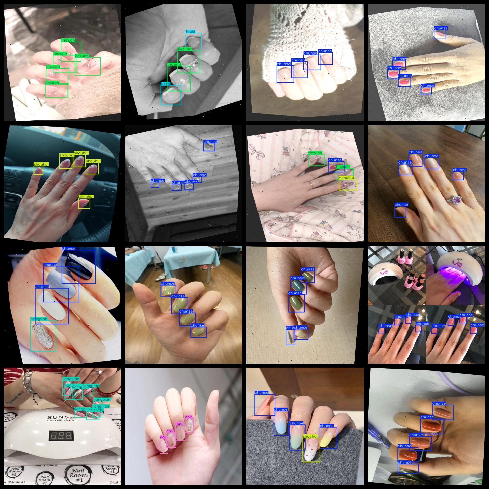
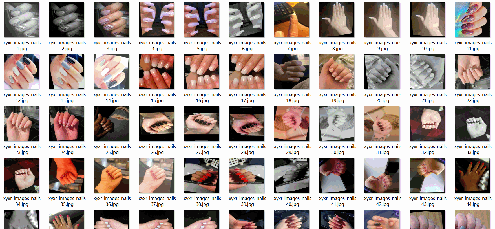

# Manicure Detection Dataset 2971 imagesVOC+YOLO format

The 2971-sample nail art detection dataset is in the format of VOC+YOLO.

Dataset format: Pascal VOC format + YOLO format (the txt file does not contain the split path, it only contains jpg images and corresponding VOC format xml files and yolo format txt files)

Number of images (total jpg file count): 2971

Number of xml files: 2971

Number of txt files: 2971

Number of categories: 9

The Github repository is: datasets_sl

["chunse", "fashi", "jianbian", "liangpian", "luose", "noc", "other", "shouhui", "tiezuan"]

Number of boxes labeled in each category:

chunse frame count = 7047

Fashion frame count = 986

The English translation is: "Jianbian frame number = 379"

liangpian frame count = 1722

The number of luose frames is 1201.

noc frame count = 1685

Other Frames = 125

The number of boxes is 1322.

tiezuan frame count = 516

Total Frames: 14983

Number of images per category:

Chunse's occupancy count = 1615

Fashion occupies a total of 184 pictures.

Jianbian's possession of images = 76

Liangpan's total image count = 546

The number of images owned by Luose is 286.

Noc occupancy count = 353

Other occupancy of images = 28

Shouhui's number of pictures = 417

Tiezuan has 179 pictures.

Image resolution: 640x640

Use the labeling tool: labelImg

Dataset Augmentation: Yes

Rules for annotation: Draw a rectangle around the category.

Important note: The dataset does not have been divided into training, validation, and testing sets.

Special Disclaimer: This dataset does not guarantee the accuracy of the trained models or weight files.

## Images

---

Here is a pay link on Stripe (https://buy.stripe.com/3cs8yP7sY87d0vu9AB). Please contact me lonlonago@foxmail.com after funding $89, and I will send you a complete data files, thank you!

